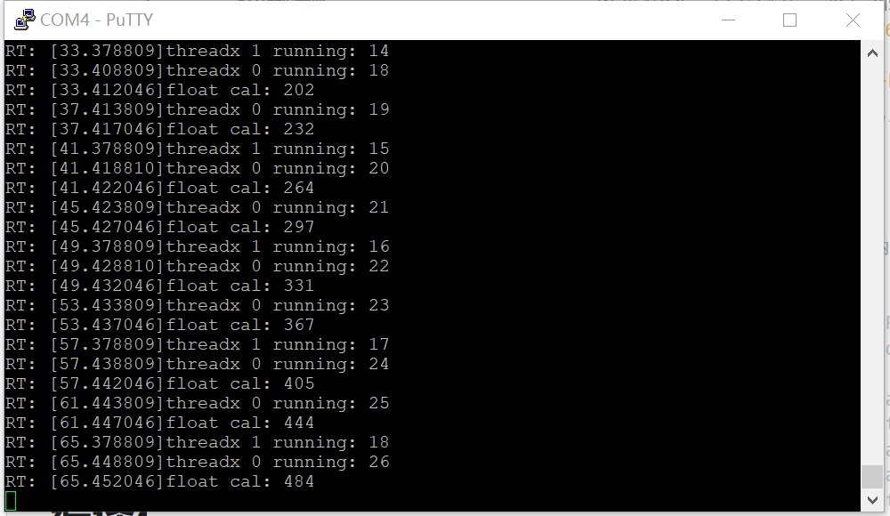

# RT-Thread Milk-V Duo 测试报告

## 测试环境

### 操作系统信息

- 构建系统版本：Ubuntu 22.04 LTS x86_64
- 系统版本：[ThreadX-to-RISC-V64](https://github.com/saicogn/ThreadX-to-RISC-V64), commit [53010e6](https://github.com/saicogn/ThreadX-to-RISC-V64/commit/53010e6b5e5916c5e84c4faf4d1a93ad960dd566)
- 源码链接：[ThreadX-to-RISC-V64](https://github.com/saicogn/ThreadX-to-RISC-V64)
- 参考安装文档：[简介](https://github.com/saicogn/ThreadX-to-RISC-V64/blob/main/README.md)

### 硬件信息

- Milk-V Duo 64M
- USB 电源适配器一个
- USB-A to C 或 USB C to C 线缆一条
- TF 卡一张
- USB to UART 调试器一个（如：CH340, CH341, FT2232 等）
- 杜邦线三根
- Milk-V Duo 本体上预先焊接好调试所需的排针

## 构建步骤

### 准备系统环境

```bash
sudo apt install -y pkg-config build-essential ninja-build automake autoconf libtool wget curl git gcc libssl-dev bc slib squashfs-tools android-sdk-libsparse-utils jq python3-distutils scons parallel tree python3-dev python3-pip device-tree-compiler ssh cpio fakeroot libncurses5 flex bison libncurses5-dev genext2fs rsync unzip dosfstools mtools tcl openssh-client cmake expect -y
```

### 下载和构建

```bash
git clone https://github.com/milkv-duo/duo-buildroot-sdk.git --depth=1
cd duo-buildroot-sdk/
./build.sh milkv-duo -j${nproc}
```

此时会产生 `out/milkv-duo-????????-????.img` 的镜像文件。该文件为镜像。

如此过程不正常，请参考 [项目简介](https://github.com/milkv-duo/duo-buildroot-sdk/blob/develop/README-zh.md) 排除故障。

### 展开 ThreadX-to-RISC-V64

在 `duo-buildroot-sdk` 中运行。

```bash
git clone https://github.com/saicogn/ThreadX-to-RISC-V64.git --depth=1
```

然后修改 `build/milkvsetup.sh`。大约为 455 行。

```text
  FREERTOS_PATH="$TOP_DIR"/freertos
```

修改为

```text
  #FREERTOS_PATH="$TOP_DIR"/freertos # 修改此项
  FREERTOS_PATH="$TOP_DIR"/ThreadX-to-RISC-V64
```

然后构建。

```bash
./build.sh milkv-duo -j${nproc}
```

此时会产生 `out/milkv-duo-????????-????.img` 的镜像文件。该文件为镜像。刷写到 SD 卡即可。

### 准备 TF 卡

将产生的 `out/milkv-duo-????????-????.img` 刷入 TF 卡即可。可使用 rufus。

### 登录系统

通过串口登录系统。

## 预期结果

系统正常启动，输出 threadx 相关信息。

## 实际结果

系统正常启动，输出 threadx 相关信息。

### 启动信息

启动完成后串口输出如下内容。

```text
[root@milkv-duo]~# RT: [9.378810]threadx 1 running: 11
RT: [9.381959]threadx 0 running: 12
RT: [9.385273]float cal: 54
RT: [13.383809]threadx 0 running: 13
RT: [13.387046]float cal: 75
RT: [17.378809]threadx 1 running: 12
RT: [17.388810]threadx 0 running: 14
RT: [17.392046]float cal: 97
RT: [21.393809]threadx 0 running: 15
RT: [21.397046]float cal: 121
RT: [25.378809]threadx 1 running: 13
RT: [25.398810]threadx 0 running: 16
RT: [25.402046]float cal: 147
RT: [29.403809]threadx 0 running: 17
RT: [29.407046]float cal: 174
RT: [33.378809]threadx 1 running: 14
RT: [33.408809]threadx 0 running: 18
RT: [33.412046]float cal: 202
RT: [37.413809]threadx 0 running: 19
RT: [37.417046]float cal: 232
```

屏幕截图：



## 测试判定标准

测试成功：实际结果与预期结果相符。

测试失败：实际结果与预期结果不符。

## 测试结论

测试成功。