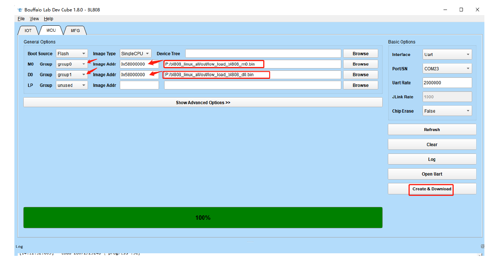
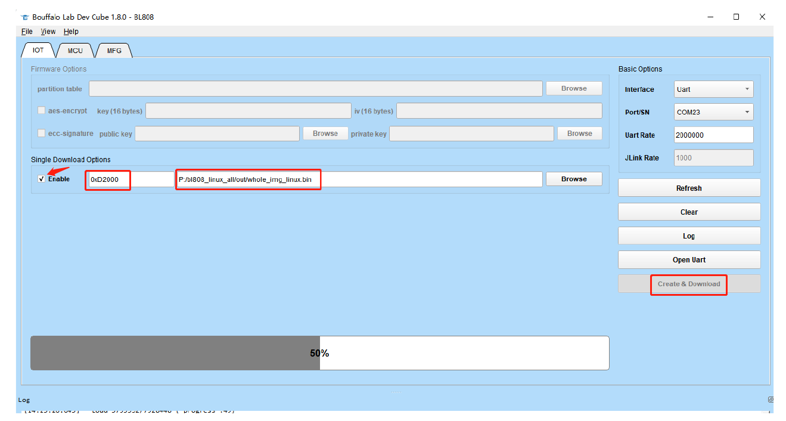

# BuildRoot Sipeed M1s Dock 测试报告

## 测试环境

### 操作系统信息

- 系统版本：20240401
- 下载链接：https://github.com/sipeed/LicheeRV-Nano-Build/releases
    - 预编译镜像：https://dl.sipeed.com/fileList/MAIX/M1s/M1s_Dock/7_Firmware/m1sdock_linux_20221116.zip
- 参考安装文档：https://github.com/sipeed/LicheeRV-Nano-Build/releases

### 硬件信息

- Sipeed M1s Dock
- type-c 线一根

## 安装步骤

### 获取镜像

下载并解压预编译镜像：
```bash
wget https://dl.sipeed.com/fileList/MAIX/M1s/M1s_Dock/7_Firmware/m1sdock_linux_20221116.zip
unzip m1sdock_linux_20221116.zip

```

### 串口方式刷写程序

使用 type-c 线连接电脑和**标有 UART**的 C 口

下载烧录工具后使用对应系统的工具烧录。

上电后，先按住 boot，再按 rst，再松开 boot。

进入 MCU 页面，刷入 m0 与 d0（文件为 low_load_bl808_m0/d0@0x58000000.bin），地址为0x58000000，group都为group0。串口选择高串口！



接下来进入 IOT 页面，勾上 Single Download Options，起始地址填文件名中的，刷入 whole_img 文件。



### 连接串口

将 type-c 线连接到**标有 UART**的 C 口。

## 预期结果

系统正常启动，能够看到串口输出。

## 实际结果

系统正常启动，能够看到串口输出。

### 启动信息

```log
--------Start Local Services--------
********************************
********************************

Linux login: root
login[40]: root login on 'ttyS0'
Processing /etc/profile ... 
Set search library path in /etc/profile
Set user path in /etc/profile
id: unknown ID 0
Welcome to Linux
[@Linux root]#uname -a
Linux Linux 5.10.4 #4 SMP Fri Nov 4 18:23:30 CST 2022 riscv64 GNU/Linux
[@Linux root]#cat /proc/cpuinfo 
processor       : 0
hart            : 0
isa             : rv64imafdcvsu
mmu             : sv39
model name      : T-HEAD C910
freq            : 1.2GHz
icache          : 64kB
dcache          : 64kB
l2cache         : 2MB
tlb             : 1024 4-ways
cache line      : 64Bytes
address sizes   : 40 bits physical, 39 bits virtual
vector version  : 0.7.1

[@Linux root]#

```

屏幕录像（进入系统）：

[](https://asciinema.org/a/R5eNAV87OGvoJfoNcpVCtMKRO)

## 测试判定标准

测试成功：实际结果与预期结果相符。

测试失败：实际结果与预期结果不符。

## 测试结论

测试成功。