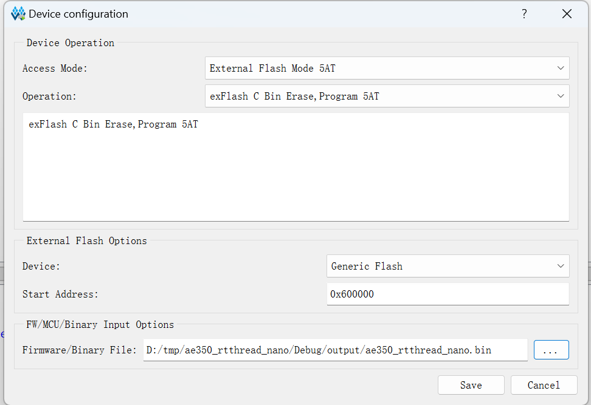

# RT-Thread Tang Mega 138K Pro 测试报告

## 测试环境

### 操作系统信息

- 构建系统：Linux
- RT-Thread
- 源码下载链接：https://cdn.gowinsemi.com.cn/RiscV_AE350_SOC_V1.1.zip
	- bitstream：https://github.com/sipeed/TangMega-138KPro-example
- 参考安装文档：https://cdn.gowinsemi.com.cn/MUG1029-1.1_Gowin_RiscV_AE350_SOC%E8%BD%AF%E4%BB%B6%E7%BC%96%E7%A8%8B%E7%94%A8%E6%88%B7%E6%89%8B%E5%86%8C.pdf
- 参考设计文档：https://cdn.gowinsemi.com.cn/MUG1031-1.1_Gowin_RiscV_AE350_SOC%E7%A1%AC%E4%BB%B6%E8%AE%BE%E8%AE%A1%E7%94%A8%E6%88%B7%E6%89%8B%E5%86%8C.pdf

### 硬件信息

- Tang Mega 138K Pro Dock
- type A to C 线一根
- UART串口线一根
- 随机电源线

## 安装步骤

**以下以 Linux 系统下的构建为例，Windows 下请安装 AE350 SOC RDS，并在附带的 cygwin 环境下进行除注明外相同的操作**

*若不需要 IDE 功能，Windows 下构建不需要 RDS License*

### 拷贝并 patch 代码

RT-Thread 代码位于源码压缩包内，ref_design/MCU_RefDesign/ae350_rtthread_nano 路径下。将其解压到您的工作区。


若为 Linux：patch Debug/makefile:
替换以下内容：
```diff
diff --git a/Debug/makefile b/Debug/makefile
index eb97e6d..232a162 100644
--- a/Debug/makefile
+++ b/Debug/makefile
@@ -119,7 +119,7 @@ $(SECONDARY_OUTPUT_PATH)/.PHONY.size: $(LINKER_OUTPUTS)
 
 $(SECONDARY_OUTPUT_PATH)/ae350-ddr.ld: $(SAG_SRCS)
 	@echo 'Invoking: LdSaG Tool'
-	nds_ldsag --version=v5 -t "$(ANDESIGHT_ROOT)/utils/nds32_template_v5.txt" "$(SAG_FILE)" -o $(LDSAG_OUT)
+	cp ../src/bsp/sag/ae350-ddr.ld $(LDSAG_OUT)
 	@echo 'Finished building: $@'
 	@echo ' '
 

```
失败请注意换行符应为 CRLF

替换工作路径：
```bash
find -name "*.mk" -exec sed -i "s|/cygdrive/E/RDS5/workspace/ae350_rtthread_nano|$(pwd)|g" {} \;
```

### 编译代码

#### Linux
解包交叉编译工具链，此处建议使用 nds32le-elf-mculib-v5。其位置以下记为 `$(nds32_path)`

编译目标文件：
```bash
cd Debug
make CROSS_COMPILE=$(nds32_path)/bin/riscv32-elf-
```

#### Windows
打开 RDS 自带的 cygwin 环境：
运行 RDS 安装目录下的 cygwin/Cygwin.bat

cd 到源码文件夹（磁盘在 `/cygdrive/$(盘符)` 下）

编译目标文件，以下 RDS_ROOT 应被替换为您 RDS 的安装路径：
```bash
cd Debug
make ANDESIGHT_ROOT=<RDS_ROOT> CROSS_COMPILE=<RDS_ROOT>/toolchains/nds32le-elf-mculib-v5/bin/riscv32-elf-
```

### 获取 FPGA 码流

**Tang Mega 138K 支持仅在商业版中提供**

FPGA 工程可以使用 Sipeed 官方提供的 demo，位于 [TangMega-138KPro-example](https://github.com/sipeed/TangMega-138KPro-example) 中的 ae350_customized_demo 里。其中码流已经编译好，不需要重新生成。

### 下载码流

连接 FPGA，使用高云云源软件下载码流。

### 烧录程序

使用 RDS 目录下 flash 中的 programmer.exe 进行烧录。设置如下：
- External Flash Mode 5AT
- exFlash C Bin Erase, Program 5AT
- Start address: 0x600000



烧录程序后若无输出，需要再次重新下载码流。

### 连接串口

默认的 UART2 被绑定到了：
```
IO_LOC "UART2_TXD" U16;     //1
IO_LOC "UART2_RXD" V16;     //2
```

### 查看输出

通过串口查看 RT-Thread 输出。

### 查看输出

通过串口查看 RT-Thread 输出。

## 预期结果

系统正常启动，能够通过板载串口查看 RT-Thread 输出。

## 实际结果

系统正常启动，能够通过板载串口查看 RT-Thread 输出。

### 启动信息

```log

It's a RT-Thread Nano version demo.

Initializes RT hw board...

 \ | /

- RT -     Thread Operating System

 / | \     3.1.5 build Apr 16 2024

 2006 - 2020 Copyright by rt-thread team

RT demo...

```

## 测试判定标准

测试成功：实际结果与预期结果相符。

测试失败：实际结果与预期结果不符。

## 测试结论

测试成功。