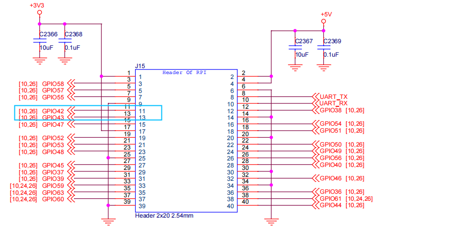

# RE-Thread VisionFive 2 测试报告

## 测试环境

### 系统信息

- Host: Arch Linux
- 参考安装文档：[https://doc.rvspace.org/VisionFive2/Application_Notes/RT-Thread/index.html](https://doc.rvspace.org/VisionFive2/Application_Notes/RT-Thread/index.html)

### 硬件信息

- StarFive VisionFive2
- 电源适配器
- USB to UART 调试器两个（分别用于连接 Linux 和 RT-Thread）

## 安装步骤

### 编译系统

获取工具链：scons

```bash
sudo pacman -Syu scons
# sudo apt-get install scons
```

下载代码：

```bash
git clone https://github.com/starfive-tech/VisionFive2.git
cd VisionFive2
git checkout --track origin/rtthread_AMP
git submodule update --init --recursive
```

初始化仓库：

```bash
cd buildroot && git checkout --track origin/JH7110_VisionFive2_devel && cd ..
cd u-boot && git checkout --track origin/rtthread_AMP && cd ..
cd linux && git checkout --track origin/rtthread_AMP && cd ..
cd opensbi && git checkout rtthread_AMP && cd ..
cd soft_3rdpart && git checkout JH7110_VisionFive2_devel && cd ..
cd rtthread && git checkout rtthread_AMP && cd ..
```

下载工具链：

```bash
wget https://github.com/starfive-tech/rt-thread/blob/rtthread_AMP/toolchain/tool-root1.tar.gz
sudo tar xf rtthread/toolchain/tool-root1.tar.gz -C /opt/
```

编译：
```bash
# scons --menuconfig # 若需配置再运行
make -j($nproc)
```

**注：编译时间较长，保持良好网络连接并耐心等待**

### 运行系统

连接两个调试串口，RTOS 的如图：


> Pin9、Pin11 和 Pin13 组成一个完整的串口：
> Pin9 (GND)
> Pin11 (GPIO42): UART1 RX
> Pin13 (GPIO43): UART1 TX

烧写编译出的 `u-boot-spl.bin.normal.out` 和 `visionfive2_fw_payload.img` 文件。官方教程为用 xmodem 烧写到 flash，但也可以烧写到 sd 卡以避免覆盖原有的 boot。

以下为烧写到 sd 卡的示例。需要首先准备好 VisionFive2 的 Debian SD 卡镜像。

```bash
sudo dd if=starfive-jh7110-202403-SD-minimal-desktop-wayland.img of=/dev/mmcblk0 bs=1M status=progress
```

接下来将 spl 和 uboot 替换：
```bash
dd if=u-boot-spl.bin.normal.out of=/dev/your-device-p1 conv=fsync
dd if=visionfive2_fw_payload.img of=/dev/myour-device-p2 conv=fsync
```

注意此种方式需要将 boot 选为从 sd 卡启动。

## 预期结果

系统正常启动，输出 Hello World 信息。

## 实际结果

```log
OpenSBI v0.9
vicap_mcm_init[I/utest] utest is initialize success.
[I/utest] total utest testcase num: (17)
RT-SMART Hello RISC-V
msh />ov5647_power_rest OV564press 'q' to exit application!!
7_CAM_PIN is 0 
kd_vi_open_timestamp>enable stc
kd_mpi_isp_set_output_chn_format, width(1920), height(1080), pix_format(2)
kd_mpi_isp_set_output_chn_format, width(1280), height(720), pix_format(7)
ov5647_power_rest OV5647_CAM_PIN is 0 
vtotal 0 vactive 0 htotal_sys 0
[dw] init, version Feb  5 2024 16:26:41
<ipcm> phys 0x180000, size 0x79000
q
release reserved vb 275623936
release reserved vb 0
ov5647_power_rest OV5647_CAM_PIN is 0                                    
ps
thread               pri  status      sp     stack size max used left tick  error
-------------------- ---  ------- ---------- ----------  ------  ---------- ---
tshell                20  running 0x00000c3a 0x00014000    03%   0x00000004 OK
sharefs_client         5  suspend 0x0000050a 0x00006000    05%   0x00000005 EINTRPT
thermal_detect_threa  16  suspend 0x000004da 0x00002800    12%   0x0000000a EINTRPT
auto_load_thread      16  suspend 0x000004ca 0x00002800    12%   0x0000000a EINTRPT
ipcm-discovery         5  suspend 0x000004fa 0x00001000    41%   0x00000001 EINTRPT
ipcm-recv              5  suspend 0x0000051a 0x00001000    33%   0x00000005 EINTRPT
tidle0                31  ready   0x00000478 0x00004000    09%   0x0000001a OK
timer                  4  suspend 0x00000488 0x00004000    07%   0x00000009 OK
msh />

```


## 测试判定标准

测试成功：实际结果与预期结果相符。

测试失败：实际结果与预期结果不符。

## 测试结论

测试成功。
